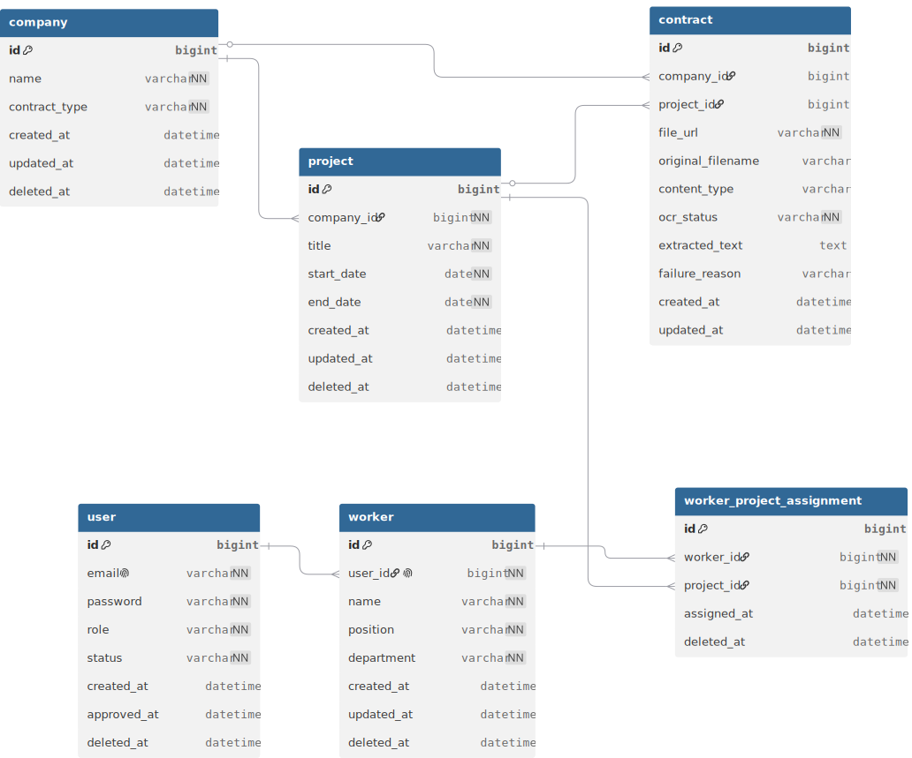

# 계약 업체 관리 백오피스 시스템

오픈소스컨설팅의 계약 업체와 외주 작업자를 관리하는 백오피스입니다. 계약서를 올리면 OCR/LLM이 업체명·계약기간을 읽어서 업체/프로젝트를 자동으로 만들고, 관리자는 작업자를 승인하고 프로젝트에 배정합니다.

## 기술 스택

| 영역 | 선택 |
|---|---|
| 언어/프레임워크 | Java 21, Spring Boot 3.x |
| DB | MySQL 8 |
| 비동기 처리 | Kafka (KRaft, 단일 브로커) |
| OCR | Tesseract (Docker) |
| LLM | Ollama + EXAONE 3.5 2.4b |
| 인증 | JWT (Access/Refresh) |
| 빌드 | Gradle |

JPA는 DDD 애그리거트 구조를 표현하기 좋고, Repository 인터페이스 분리와 Query Method로 보일러플레이트를 줄일 수 있어서 선택했습니다.

DB는 데이터 간 관계가 명확하고 트랜잭션 정합성이 중요해서 RDB로 한정했습니다. H2 같은 인메모리는 영속성이 없어 제외했고, NoSQL은 조인이 많은 도메인 특성상 맞지 않다고 봤습니다. PostgreSQL이나 MariaDB도 검토했지만 계정/스키마 설정이 가장 간단한 MySQL로 결정했습니다.

빌드 도구는 Maven의 XML 설정이 장황해서 더 간결한 Gradle DSL로 갔습니다.

외부 연동은 Google Drive, Jira, 상용 OCR/LLM API 등을 검토했지만 API Key 발급이나 OAuth가 필요한 건 평가 환경에서 테스트하기 번거로워서 제외했습니다. `docker compose up`만으로 키 없이 끝까지 동작하는 Tesseract와 Ollama만 채택했습니다.

LLM 모델은 처음에 Qwen2.5-3B를 썼는데 업체명/날짜 추출 정확도가 낮았습니다. 한국어 이중언어로 학습된 EXAONE 3.5로 바꾼 뒤 정확도가 나아져서 최종 채택했습니다. 로컬 실행 부담을 고려해 2.4b 크기로 유지했습니다.

## 실행 방법

```bash
docker compose up -d   # MySQL, Kafka, Ollama, Tesseract 기동
./gradlew bootRun       # 또는 IDE에서 바로 실행
```

최초 기동 시 Ollama가 모델(약 1.5GB)을 받느라 몇 분 걸립니다. Swagger UI는 `http://localhost:8080/swagger-ui.html`, Kafka UI는 `http://localhost:8089`입니다.

### 초기 데이터

앱을 처음 띄우면 작업자 계정 3개가 자동으로 만들어집니다 (재기동 시 중복 생성 안 함).

| 이메일 | 비밀번호 | 이름 | 직책 | 부서 |
|---|---|---|---|---|
| worker1@osci.com | password1234 | 김민준 | 대리 | 개발팀 |
| worker2@osci.com | password1234 | 이서연 | 과장 | 영업팀 |
| worker3@osci.com | password1234 | 박지훈 | 사원 | 기획팀 |

관리자는 자동 시드되지 않으므로 `POST /api/v1/users/admin`으로 직접 가입해야 합니다.

### 사용 흐름

1. `POST /api/v1/users/admin`으로 관리자 가입 (가입 즉시 승인됨)
2. `POST /api/v1/users`로 일반 유저 가입 (승인 대기)
3. 관리자가 `GET /api/v1/users?status=PENDING` 조회 후 `POST /api/v1/users/{id}/approve`로 승인
4. 승인된 유저는 `POST /api/v1/workers/me`로 본인 프로필(이름/직책/부서) 등록
5. 관리자가 `POST /api/v1/projects/{projectId}/workers/{workerId}`로 배정

### 테스트용 샘플 계약서

직접 파일을 준비하지 않아도 되게 샘플을 같이 넣어뒀습니다. 모두 가상의 업체명/사업자등록번호이며 실제 거래 업체와는 무관합니다.

| 파일 | 형식 | 내용 |
|---|---|---|
| [contract_1.pdf](./sample-contracts/contract_1.pdf) | PDF (텍스트 포함) | 갑: 오픈소스컨설팅 / 을: 주식회사 그린테크 |
| [contract_2.pdf](./sample-contracts/contract_2.pdf) | PDF (텍스트 포함) | 갑: 주식회사 가람물산 / 을: 오픈소스컨설팅 |
| [contract_3_handwritten.png](./sample-contracts/contract_3_handwritten.png) | 이미지 (OCR용) | 갑: 오픈소스컨설팅 / 을: 미래테크 주식회사 |

## 계약서 업로드 FlowChart


**계약서 처리 흐름**
1. 업로드 시 파일을 디스크에 저장하고 `Contract`를 PENDING으로 저장 (커밋)
2. 커밋 후 Kafka에 `contractId`만 발행 (파일 바이트는 안 실음 — 메시지 크기/지연 문제 방지)
3. Consumer가 파일을 다시 로드 → PDF는 텍스트 직접 추출, 이미지는 OCR
4. 추출 텍스트를 LLM에 넘겨 업체명/계약기간 추출
5. 업체명으로 Company를 찾거나 생성 → 그 안에 Project 생성 → Contract에 연결
6. 실패 시 최대 2회 재시도, 모두 실패하면 FAILED로 확정

## DB 설계



- Company와 Project는 같은 애그리거트입니다. Project는 Company를 통해서만 생성/수정됩니다 (package-private).
- Contract는 독립된 애그리거트입니다. 업로드 시점엔 어느 업체/프로젝트인지 모르기 때문에(OCR 끝나야 확정), Company/Project를 객체 참조가 아니라 ID로만 들고 있습니다. 그래야 애그리거트 간 Hibernate flush 순서에 안 걸려서 `TransientObjectException` 같은 문제가 안 생깁니다.
- Worker도 독립 애그리거트입니다. User는 ID로만 참조하고, Worker-Project 배정은 별도 조인 엔티티로 관리합니다.
- `contract.company_id`/`project_id`는 조회 시 자주 필터링되는 컬럼이라 인덱스가 필요한데, 지금은 `ddl-auto: update`로만 운영 중이라 운영 전환 시 마이그레이션 도구로 명시적으로 잡아줘야 합니다.

## 계층 구조

```
domain/         엔티티, Repository 인터페이스
application/    UseCase, Facade(흐름 조율), CommandService/QueryService, DTO
infrastructure/ JPA 구현체, Kafka, OCR/LLM/파일저장 연동, Security, 예외 처리
presentation/   Controller (HTTP ↔ UseCase 변환만)
```

Repository는 도메인 인터페이스와 JPA 구현체(다중 상속)로 나눠져 있고, Controller는 인프라를 직접 호출하지 않고 항상 UseCase만 의존합니다. "파일 하나 실패해도 나머지는 계속 처리한다" 같은 정책은 Controller가 아니라 Facade에 둡니다.

## AI 도구 활용

Claude로 설계부터 백엔드/프론트엔드 코드 작성, 트러블슈팅(Kafka 코디네이터 오류, Hibernate `TransientObjectException`, Lombok `@Builder` + 컬렉션 초기화 문제 등)까지 진행했습니다. 직접 수정/검토한 부분은:

- 애그리거트 경계(어떤 걸 ID로만 참조할지)는 실제 런타임 오류를 분석해서 다시 잡았습니다.
- `CommonResponse`의 상태코드 처리, `BusinessExceptionType` 코드 중복은 코드 리뷰하면서 발견해 고쳤습니다.
- 프론트엔드 권한별 화면 노출, Kafka 메시지 설계(파일 대신 ID만 전달) 등은 요구사항을 직접 정하고 반복해서 다듬었습니다.

## 미완성 / 개선하고 싶은 점

- OCR/LLM 정확도가 상용 API보다 낮습니다. `TextExtractor`/`ContractInfoExtractor`를 인터페이스로 분리해서 구현체만 교체하면 됩니다.
- Google Drive 일괄 등록, Jira 연동(작업 배정 시 이슈 자동 생성)은 기획했지만 OAuth/API Key 설정 부담으로 범위에서 뺐습니다.
- `GET /api/v1/projects/{id}`는 로그인만 하면 누구나 조회할 수 있어, 작업자가 본인 미배정 프로젝트도 ID만 알면 볼 수 있습니다. 배정 여부 검증은 안 넣었습니다.
- OCR 처리 상태는 5초 폴링으로 갱신합니다. WebSocket/SSE면 더 즉각적입니다.
- Kafka 토픽이 단일 파티션/단일 컨슈머라 업로드가 몰리면 병목이 생길 수 있습니다. 파티션을 늘리고 컨슈머를 여러 개 두는 식으로 개선할 수 있습니다.
- `Project.update()`의 기간 검증은 `IllegalArgumentException`을 직접 던지는데, `GlobalExceptionHandler`가 `BusinessException`만 400/404로 매핑하다 보니 이 경우는 500으로 떨어집니다. `BusinessException(INVALID_INPUT)`으로 바꿔야 합니다.
- `ContractUseCase.uploadContracts()`가 Spring Web의 `MultipartFile`을 파라미터로 그대로 받고 있어 application 계층이 web 계층 타입에 의존합니다. Controller에서 `byte[]`+파일명 정도의 순수 객체로 변환해 넘기는 게 더 깔끔합니다.
- Company를 삭제하면 그 안의 Project는 cascade로 같이 삭제 처리되지만, Contract는 ID로만 연결되어 있어 같이 정리되지 않습니다. 삭제된 업체를 가리키는 Contract가 고아 데이터로 남을 수 있어 별도 정리 로직이 필요합니다.
- 파일 저장 후 DB 저장이 실패하면 디스크에 더미 파일이 남아서, 이 경우엔 방금 저장한 파일을 보상 삭제하도록 처리했습니다. 다만 그 다음 단계인 Kafka 발행이 실패하면 Contract는 이미 커밋된 상태라 파일을 지울 수 없고, 결과적으로 그 Contract가 PENDING에 멈춥니다. Outbox 패턴이나 PENDING 재발행 스케줄러로 보완이 필요한데 아직 미구현입니다.